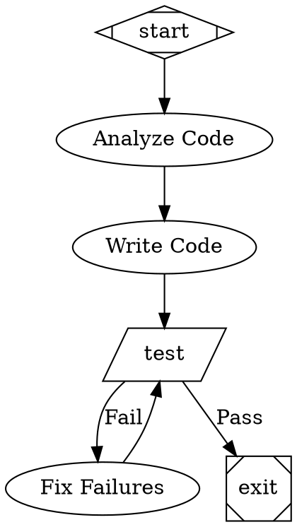

# Attractor - Pipeline Workflows

Build autonomous multi-step software tasks using DAG-based pipeline workflows.

Based on StrongDM's [Attractor](https://github.com/brynary/attractor) — a TypeScript framework for non-interactive coding agents that execute through visual workflow graphs.

## Setup (First Use)

Attractor requires the Bun runtime. Install once per session:

```bash
sudo apt-get update && sudo apt-get install -y unzip
curl -fsSL https://bun.sh/install | bash
source ~/.bashrc

# Clone and install attractor
git clone https://github.com/brynary/attractor.git /tmp/attractor
cd /tmp/attractor && bun install
```

## Progress Reporting

**Always send a status update via `mcp__nanoclaw__send_message` when entering each workflow node.** This lets the user follow along in real time.

Format: `[Pipeline] {workflow_name}: {node_label} ({node_number}/{total_nodes})`

Examples:
- `[Pipeline] FeatureImplementation: Analyze Codebase (1/5)`
- `[Pipeline] FeatureImplementation: Write Code (3/5)`
- `[Pipeline] BugFix: Run Tests — PASS (4/5)`
- `[Pipeline] BugFix: Fix Failures — retry 2/3 (4/5)`

Also send a final summary when the workflow completes or fails:
- `[Pipeline] FeatureImplementation: Complete — all tests passing`
- `[Pipeline] BugFix: Failed — max retries exceeded at Run Tests`

## Running a Workflow

```bash
# Run a pre-built workflow template
cd /tmp/attractor
bun run attractor/bin/attractor-server.ts  # HTTP server mode

# Or use the pipeline runner programmatically
bun run -e "
import { parse } from './attractor/src/parser';
import { PipelineRunner } from './attractor/src/runner';

const dot = Bun.file('/path/to/workflow.dot').text();
const graph = parse(await dot);
const runner = new PipelineRunner(graph);
await runner.run();
"
```

## Workflow Format (DOT Syntax)

Workflows are GraphViz DOT digraphs. Each node is a task, each edge is a dependency.



## Node Types

| Shape | Purpose | Key Attribute |
|-------|---------|---------------|
| `Mdiamond` | Start node | — |
| `Msquare` | Exit node | — |
| `box` (default) | LLM task | `prompt="..."` |
| `parallelogram` | Shell command | `tool_command="..."` |
| `hexagon` | Human approval gate | `label="Approve"` |
| `diamond` | Conditional routing | — |
| `component` | Parallel fan-out | — |

## Edge Attributes

- `label` — Display name and routing key
- `condition` — Boolean expression (e.g., `outcome=success`)
- `weight` — Numeric priority for edge selection

## Pre-built Workflows

Templates in the `workflows/` directory (relative to this skill):

- *feature-add.dot* — New feature with design → approve → implement → test loop
- *bug-fix.dot* — Investigate → fix → regression test loop
- *refactor.dot* — Baseline tests → refactor → verify loop
- *code-review.dot* — Analyze → fix → verify → human review

Copy and customize these for your task. The workflow files are at:
`/home/node/.claude/skills/attractor/workflows/`

## Key Patterns

### Test-driven loop (most common)
```dot
implement -> test
test -> exit [condition="outcome=success"]
test -> fix [condition="outcome!=success"]
fix -> test
```

### Human approval gate
```dot
review [shape=hexagon, label="Review Changes"]
review -> next [label="[A] Approve"]
review -> redo [label="[R] Revise"]
```

### Parallel fan-out
```dot
fanout [shape=component]
fanout -> task_a -> fanin
fanout -> task_b -> fanin
fanin [shape=tripleoctagon]
```

### Retry with limit
```dot
graph [default_max_retry=3]
test [goal_gate=true]
```

## When to Use

- Multi-step tasks with clear phases (analyze → design → implement → test)
- Tasks that need retry loops (implement until tests pass)
- Work that benefits from human checkpoints
- Parallel independent subtasks

## When NOT to Use

- Simple one-shot tasks (just do them directly)
- Tasks with unclear requirements (brainstorm first, then maybe use a workflow)
- Quick fixes or config changes
