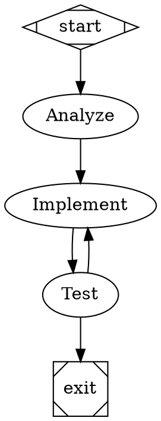
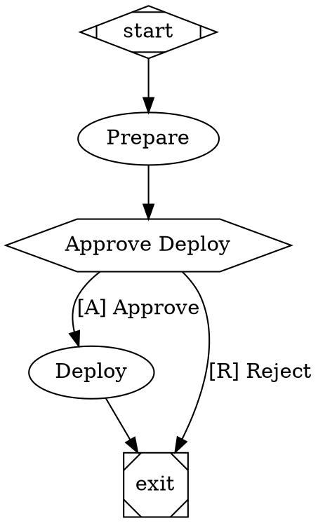
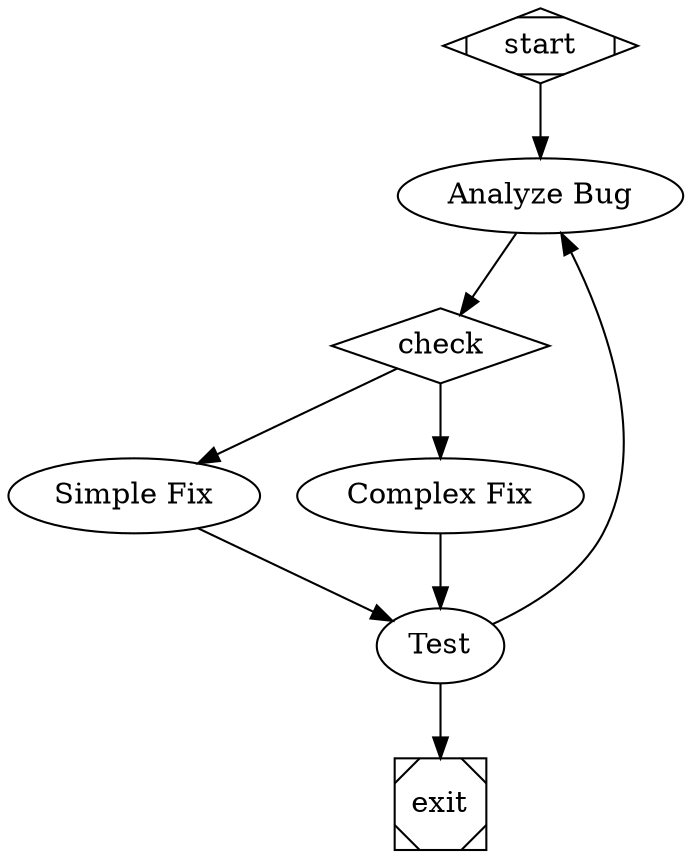

# Attractor Pipeline Workflows

## What This Does

You can run multi-step workflows using DOT-based pipelines. The host orchestrates execution — you just compose the workflow graph and submit it. Each node in the graph becomes a prompt sent to you by the host.

## Requesting a Pipeline

Write a JSON file to your IPC tasks directory:

```bash
cat > /workspace/ipc/tasks/pipeline_$(date +%s).json << 'EOF'
{
  "type": "start_pipeline",
  "dot": "digraph Feature {\n  graph [goal=\"Add RSI indicator\"]\n  start [shape=Mdiamond]\n  analyze [label=\"Analyze Codebase\", prompt=\"Review the codebase and identify where to add the RSI indicator\"]\n  implement [label=\"Implement\", prompt=\"Write the RSI indicator code\"]\n  test [label=\"Run Tests\", prompt=\"Run tests and verify the implementation\"]\n  exit [shape=Msquare]\n  start -> analyze -> implement -> test -> exit\n  test -> implement [condition=\"outcome=fail\"]\n}",
  "verbosity": "standard"
}
EOF
```

## DOT Syntax Reference

### Node Shapes

| Shape | Type | Behavior |
|-------|------|----------|
| `Mdiamond` | Start | Pipeline begins here. No-op. |
| `Msquare` | Exit | Pipeline ends. Checks goal gates. |
| `box` (default) | Codergen | You receive a prompt and do work. |
| `diamond` | Conditional | Host evaluates edges, routes automatically. |
| `hexagon` | Wait Human | Pauses for user approval. |
| `parallelogram` | Tool | Runs a tool command. |

### Node Attributes

| Attribute | Description |
|-----------|-------------|
| `label` | Display name for the node |
| `prompt` | The prompt text sent to you |
| `shape` | Node type (see above) |
| `max_retries` | Max retry attempts on failure (default: 0) |
| `goal_gate` | If `true`, must succeed before pipeline exits |
| `retry_target` | Node to jump to on failure |
| `isolated` | If `true`, forces fresh container session |
| `fidelity` | Context mode: `full`, `compact`, `truncate`, `summary:low/medium/high` |

### Edge Attributes

| Attribute | Description |
|-----------|-------------|
| `condition` | Boolean expression (e.g., `outcome=success`) |
| `label` | Display label for routing |
| `weight` | Priority for tiebreaking (higher = preferred) |

### Condition Syntax

```
outcome=success              # Match outcome
outcome!=fail                # Negation
outcome=success && ready=true  # AND clauses
context.my_key=value         # Context lookup
```

### Variable Expansion

Use `$goal` in prompts to reference the pipeline's goal:
```
prompt="Implement $goal using best practices"
```

## Outcome Reporting

When the host sends you a pipeline task prompt, **end your response** with:

```
[outcome:success]    # Task succeeded
[outcome:fail]       # Task failed
```

Optionally recommend the next step:
```
[preferred_label:Approve]
```

## Workflow Patterns

### Linear with Test Loop


### Human Approval Gate


### Conditional Routing


## Verbosity

Set `"verbosity"` in the IPC request:
- `"minimal"` -- Only pipeline start/end and errors
- `"standard"` -- Stage progress, routing, retries (default)
- `"verbose"` -- Everything including context updates
