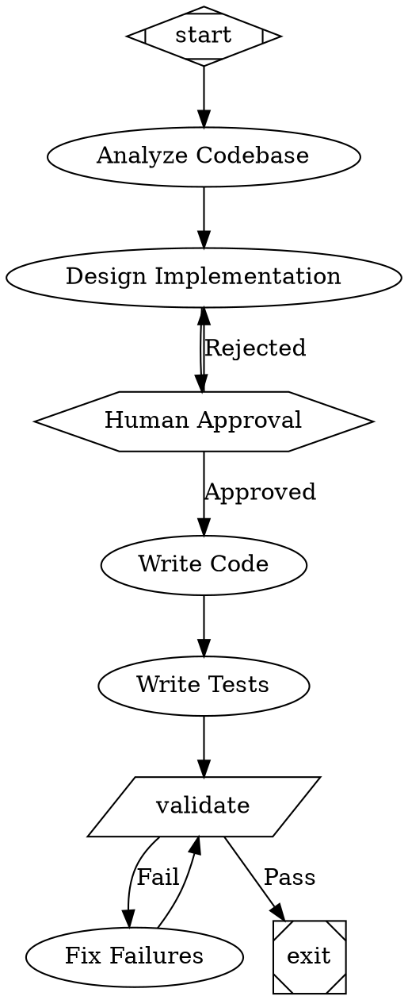
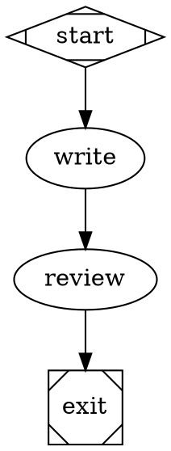
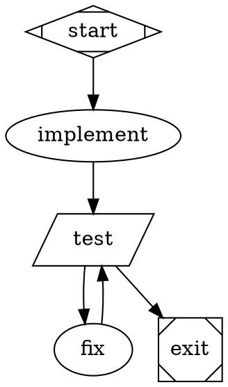
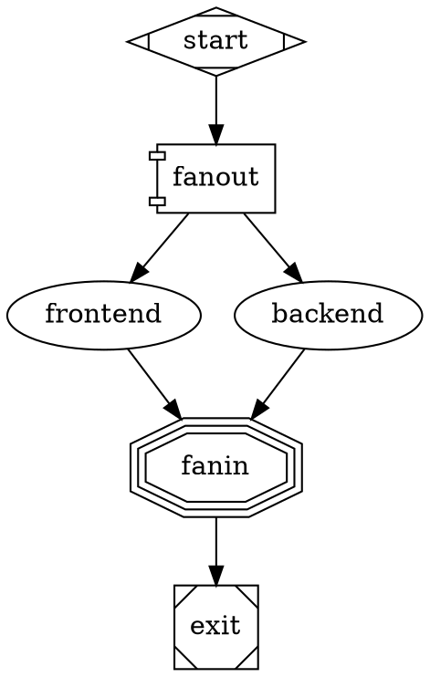

# Attractor - Software Factory Skill

Build autonomous software development pipelines using StrongDM's Attractor pattern.

## What is Attractor?

Attractor is a TypeScript framework for non-interactive coding agents that execute multi-step software tasks autonomously through visual workflow graphs:

- **DAG-based pipelines**: Tasks as nodes, dependencies as edges (DOT syntax)
- **Test-driven loops**: Iterate until tests pass
- **Checkpoints**: Resume from failures
- **Human gates**: Pause for approval when needed
- **Self-healing**: Retry and fix failures automatically
- **Parallel execution**: Fan-out/fan-in for concurrent work

Based on: https://github.com/brynary/attractor

## How It Works

1. **Define workflow** in GraphViz DOT format
2. **Parse graph** into execution plan
3. **Execute nodes** using LLM backends (Claude, OpenAI, CLI agents)
4. **Handle checkpoints** for resume capability
5. **Stream events** for monitoring
6. **Loop until complete**

## Integration with NanoClaw

This skill wraps the brynary/attractor TypeScript implementation to work with NanoClaw's agent infrastructure. The attractor library is included as a git submodule.

## Workflow Format (DOT Syntax)



## Node Types

- **box** (default): LLM task with prompt
- **hexagon**: Human approval gate (wait.human)
- **diamond**: Conditional routing
- **component**: Parallel fan-out execution
- **parallelogram**: Shell command/tool execution
- **Mdiamond**: Start node
- **Msquare**: Exit node

## Edge Features

- **label**: Display name and routing key
- **condition**: Boolean expression (e.g., `outcome=success`)
- **weight**: Numeric priority for edge selection

## Pre-built Workflows

Located in `workflows/` directory:

- `feature-add.dot` - Add new feature with approval gates
- `bug-fix.dot` - Fix bugs with regression testing
- `refactor.dot` - Refactor code safely with baseline tests
- `code-review.dot` - Automated code review with human approval

## Usage

### Via NanoClaw Task Tool

When you invoke this skill, NanoClaw will:

1. Load the requested workflow DOT file
2. Initialize the Attractor pipeline runner with NanoClaw backend
3. Execute the pipeline, streaming events back
4. Handle checkpoints for resume capability
5. Pause for human gates when required

### Programmatic Usage

```typescript
import { readFileSync } from "fs";
import {
  parse,
  PipelineRunner,
  createHandlerRegistry,
  SessionBackend,
} from "./lib/attractor";

const dot = readFileSync("workflow.dot", "utf-8");
const graph = parse(dot);

const registry = createHandlerRegistry();
const backend = new SessionBackend({ /* config */ });

const runner = new PipelineRunner({
  handlerRegistry: registry,
  backend,
  interviewer: new ConsoleInterviewer(),
});

const result = await runner.run(graph);
```

## Context and State

The pipeline maintains a key-value context that flows through nodes:

- **Read context**: Access previous results via `context.get("key")`
- **Update context**: Return `contextUpdates` in handler outcomes
- **Built-in keys**:
  - `graph.goal` - Overall pipeline goal
  - `outcome` - Status of last node (success/failure)
  - `{nodeId}_result` - Result from specific node

## Checkpoints and Resume

After each node completes, state is saved to `~/.claude/attractor/checkpoints/`:

```bash
# Resume from checkpoint
attractor resume <checkpoint-id>
```

## Backend Options

- **SessionBackend**: Full coding-agent with tool use (file editing, bash commands)
- **CliAgentBackend**: Spawn CLI agents (claude, codex) as subprocesses
- **ClaudeCodeBackend**: Direct Claude Code integration
- **StubBackend**: Mock responses for testing

## Event Streaming

Pipeline events are emitted for monitoring:

- `PIPELINE_STARTED` - Execution begins
- `STAGE_STARTED` - Node begins execution
- `STAGE_COMPLETED` - Node completes
- `HUMAN_INPUT_REQUIRED` - Waiting for approval
- `PIPELINE_COMPLETED` - Execution finished

## Commands

```bash
# Run a workflow
attractor run <workflow.dot> "goal description"

# Resume from checkpoint
attractor resume <checkpoint-id>

# List available workflows
attractor list

# Validate workflow DOT syntax
attractor validate <workflow.dot>
```

## Example Workflows

### Simple Linear Pipeline



### Test Loop with Retry



### Parallel Execution



## Dependencies

The Attractor library requires:
- Bun runtime (v1.0+)
- API keys for LLM providers (Anthropic/OpenAI) or CLI agents

Installation:
```bash
cd container/skills/attractor/lib
bun install
```

## Architecture

```
container/skills/attractor/
├── CLAUDE.md           # This file
├── lib/                # Git submodule: brynary/attractor
│   ├── attractor/      # Pipeline engine
│   ├── coding-agent/   # Agentic loop
│   └── unified-llm/    # LLM client
└── workflows/          # Pre-built pipeline templates
    ├── feature-add.dot
    ├── bug-fix.dot
    ├── refactor.dot
    └── code-review.dot
```

## Advanced Features

### Goal Gates

Mark critical nodes that must succeed:

```dot
test [prompt="Run tests", goal_gate=true]
```

If a goal gate fails, the pipeline jumps to `retry_target` and tries again.

### Retry Configuration

```dot
graph [default_max_retry=3, retry_target="implement"]
node [max_retries=2]
```

### Timeouts

```dot
node [timeout="900s"]
longRunning [timeout="3600s", prompt="Complex analysis"]
```

### Human Approval Options

```dot
review [shape=hexagon, label="Review Changes"]
review -> exit [label="[A] Approve"]
review -> implement [label="[R] Revise"]
review -> start [label="[S] Start Over"]
```

Labels with `[X]` become keyboard shortcuts in console mode.

## Integration Points

This skill integrates with:
- **Task tool**: Spawn sub-agents for parallel work
- **Bash tool**: Execute shell commands in nodes
- **Anytype**: Store pipeline results and checkpoints
- **Telegram**: Send notifications at human gates
- **coding-agent**: Full file editing and command execution

## Error Handling

The pipeline handles errors gracefully:

1. Node fails → Context updated with error
2. Conditional edges evaluate → Route to fix/retry node
3. Max retries reached → Pipeline fails with diagnostic
4. Checkpoint saved → Can resume from last good state

## Best Practices

1. **Start simple**: Linear workflow first, add branches later
2. **Use goal gates**: Mark critical nodes (tests, builds)
3. **Human gates at decisions**: Not just approvals, also direction choices
4. **Specific prompts**: Include context, expected output, constraints
5. **Test loops**: Always provide a path back from failures
6. **Checkpoint often**: Each significant step should be a node
7. **Monitor events**: Stream events for long-running pipelines

## Troubleshooting

**Pipeline stuck?**
- Check for cycles in the graph
- Verify conditional expressions in edges
- Ensure all paths lead to exit node

**Node timing out?**
- Increase timeout: `node [timeout="1800s"]`
- Break into smaller nodes
- Use parallel execution for independent work

**Context not flowing?**
- Check handler returns `contextUpdates`
- Verify key names match in conditions
- Use `graph.context` in prompts: `$variableName`

## Future Enhancements

Planned features:
- Visual graph editor
- Real-time dashboard
- Multi-user collaboration on human gates
- Pipeline templates marketplace
- Cost tracking and optimization
- Integration with CI/CD systems
