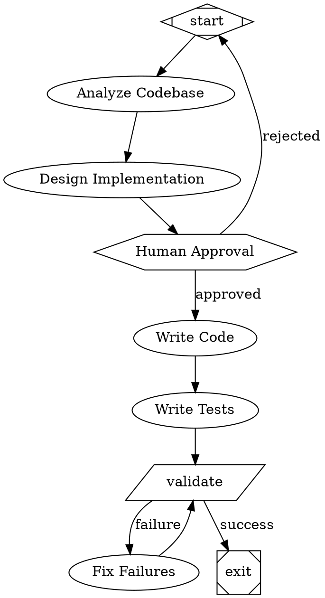

# Attractor - Software Factory Skill

Build autonomous software development pipelines using StrongDM's Attractor pattern.

## What is Attractor?

Attractor is a framework for non-interactive coding agents that execute multi-step software tasks autonomously:

- **DAG-based pipelines**: Tasks as nodes, dependencies as edges
- **Test-driven loops**: Iterate until tests pass
- **Checkpoints**: Resume from failures
- **Human gates**: Pause for approval when needed
- **Self-healing**: Retry and fix failures automatically

## How It Works

1. **Define workflow** in DOT (GraphViz) format
2. **Parse graph** into execution plan
3. **Execute nodes** using NanoClaw agents
4. **Handle checkpoints** for resume capability
5. **Loop until complete**

## Usage

```bash
# Run a workflow
attractor run <workflow.dot> "goal description"

# Resume from checkpoint
attractor resume <checkpoint-id>

# List available workflows
attractor list
```

## Workflow Format (DOT Syntax)



## Node Types

- **box** (default): LLM task via agent
- **hexagon**: Human approval gate
- **diamond**: Conditional routing
- **parallelogram**: Shell command
- **Mdiamond**: Start node
- **Msquare**: Exit node

## Pre-built Workflows

- `workflows/feature-add.dot` - Add new feature
- `workflows/bug-fix.dot` - Fix bugs
- `workflows/refactor.dot` - Refactor code
- `workflows/test-harness.dot` - Create tests

## Integration with NanoClaw

Attractor uses NanoClaw's existing agent tools:
- Task tool for spawning sub-agents
- Bash tool for running tests
- Anytype for checkpoint storage
- Telegram for human approval gates

## Example

```bash
# Add a new feature to paca-lite
attractor run workflows/feature-add.dot "Add SMA indicator helper with tests"

# The system will:
# 1. Analyze paca-lite codebase
# 2. Design implementation plan
# 3. Wait for your approval
# 4. Implement the code
# 5. Write comprehensive tests
# 6. Run tests and iterate until passing
# 7. Report completion
```

## Commands Available

When you invoke this skill, I'll execute the Attractor workflow using the Python implementation located in this directory.
